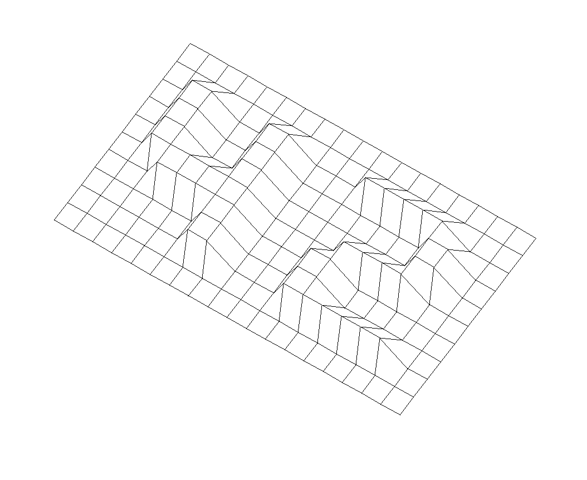
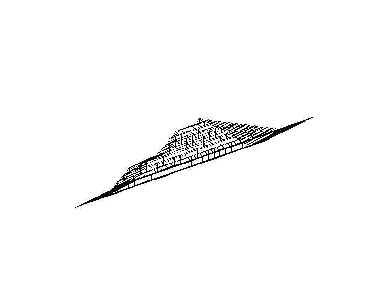
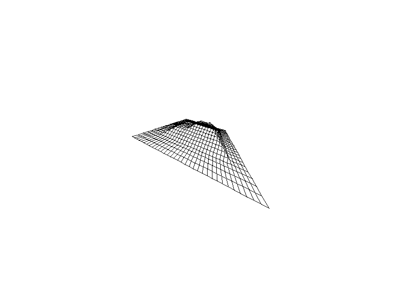

# FDF

FDF is short for ’fil de fer’ in French which means ’wireframe model’. It is a [School 42](https://42.fr/en/homepage/)
project that consists of
representing a map of points in isometric projection, rendered as a wireframe. The only given information are the
heights of the points.

The GitHub repo containing the source and Linux and MacOS builds is available [here](https://github.com/jwikiera/fdf).

The assignment subject can be found [here](https://raw.githubusercontent.com/jwikiera/fdf/master/subject.pdf).
	
I have rewritten the project in JavaScript. It is entirely contained in the `web/fdf.html` file and also hosted on
[wikiera.ch/fdf.html](https://wikiera.ch/fdf.html).

## Building

The project builds on MacOS Catalina 10.15.7 and Artix Linux 6.0.12. Other configurations were not tested.

MacOS prerequisites: Xcode.

Linux prerequisites: The X server, clang.

Then run `make` inside of the repository.

## Running

`./fdf target_map.fdf`

You can find example maps from `test_maps`.

Navigation: 
- Use the `Left` and `Right` arrow keys to rotate the model around its respective y axis.
- Use the `Up` and `Down` arrow keys to rotate the model around its respective x axis.
- Use the `A` and `D` arrow keys to rotate the model around its respective z axis.
- Use the `+` and `-` keys to zoom in or out.
- Use the `P` key to toggle between an orthogonal and perspective projection.
- Use the `W` and `S` keys to increase or decrease the field of view in perspective projection mode.
- Use the `Numpad Arrows` to translate the model.

Note: in the perspective projection, zoom out if the model intersects with the screen, in order to view it entirely.

## License

This project is licensed under the GNU AFFERO GENERAL PUBLIC LICENSE.

